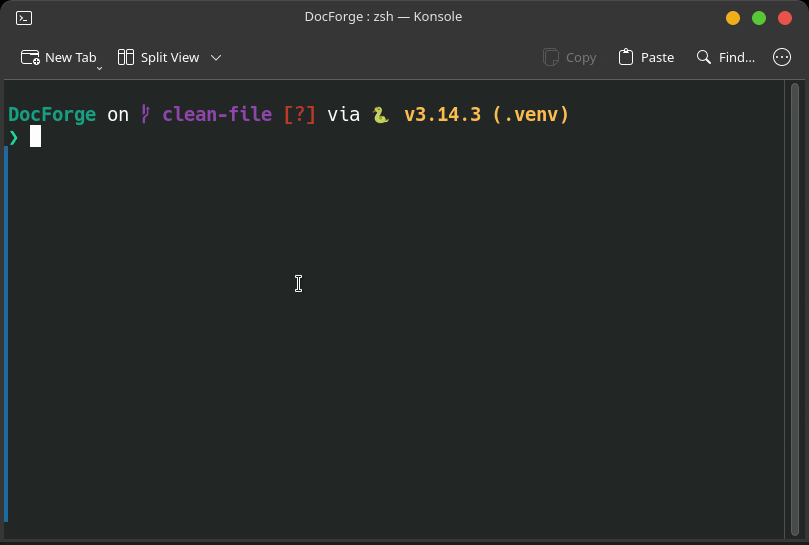

<h1 align="center">DocForge</h1>

<p align="center">
A <strong>Multi-Agent Retrieval-Augmented Generation (RAG) system</strong> built with LangGraph, featuring intelligent query routing, adaptive retrieval, fact-checking with automatic retry logic, and a FastAPI backend.
</p>

<p align="center">


</p>

<p align="center">

</p>

## Key Features

### Multi-Agent Architecture
- **Routing Agent** — Classifies query complexity (simple lookup / complex reasoning / multi-hop) and generates an optimized search query for the vector database
- **Retrieval Agent** — Adaptive document retrieval (3-10 docs based on complexity, with relaxed thresholds on retries)
- **Analysis Agent** — Synthesizes coherent, cited answers from multiple sources using chain-of-thought reasoning
- **Validation Agent** — Fact-checks every claim against source documents, identifies hallucinations, and corrects the answer if needed

### Intelligent Workflow
- **Confidence-based validation skip** — When retrieval scores are high, sources are sufficient, and no information gaps exist, validation is skipped entirely for faster responses
- **Automatic retry with adaptive strategy** — On validation failure, the system retries retrieval with 50% more documents and a relaxed relevance threshold (up to 3 attempts)
- **Redis caching** — Query results are cached (SHA-256 keyed, 1-hour TTL) so repeated queries return instantly
- **Dual LLM provider support** — Switch between OpenAI GPT (via OpenRouter) and Google Gemini with per-task model configuration

### Production-Ready
- FastAPI REST API with query endpoint
- Comprehensive error handling and graceful degradation across all agents
- Token usage tracking and latency monitoring
- Complete ETL pipeline for PDF document ingestion
- In-memory embedding cache to avoid redundant API calls

## Architecture

```
User Query
    |
    v
+-----------------+
|   Redis Cache   | <-- Check cache first
+--------+--------+
         | (cache miss)
         v
+-----------------+
|  Routing Agent  | <-- Classify complexity, optimize search query
+--------+--------+
         |
         v
+-----------------+
| Retrieval Agent | <-- Fetch 3-10 docs from Pinecone
+--------+--------+     (50% more on retry, relaxed threshold)
         |
         v
+-----------------+
| Analysis Agent  | <-- Synthesize cited answer (chain-of-thought)
+--------+--------+
         |
         v
    Confidence Check:
    |
    +-- High confidence --> Skip validation --> Return & Cache
    |
    +-- Otherwise:
         |
         v
    +-----------------+
    |Validation Agent | <-- Fact-check every claim
    +--------+--------+
             |
             v
        Decision:
        +-- Valid            --> Return & Cache
        +-- Invalid (< 3)   --> Retry from Retrieval (adaptive)
        +-- Invalid (>= 3)  --> Return corrected answer & Cache
```

## Quick Start

### Prerequisites

- Python 3.11+
- An [OpenRouter](https://openrouter.ai/) API key (for GPT models and embeddings) **or** a Google Gemini API key
- A [Pinecone](https://www.pinecone.io/) account
- Redis (optional, for caching)

### Installation

```bash
# Clone the repository
git clone https://github.com/ToheedAsghar/DocForge.git
cd DocForge

# Create virtual environment
python -m venv .venv
source .venv/bin/activate  # On Windows: .venv\Scripts\activate

# Install dependencies
pip install -r requirements.txt
```

### Configuration

Create a `.env` file in the root directory:

```bash
# LLM Provider: "gpt" or "gemini"
LLM_PROVIDER=gpt

# Required for GPT provider (via OpenRouter)
OPENROUTER_API_KEY=your-openrouter-key

# Required for Gemini provider
# GEMINI_API_KEY=your-gemini-key

# Optional: OpenAI API key (if using OpenAI directly for embeddings)
# OPENAI_API_KEY=your-openai-key

# Pinecone (required)
PINECONE_API_KEY=your-pinecone-key
PINECONE_ENVIRONMENT=us-east-1
PINECONE_INDEX_NAME=techdoc-intelligence

# Optional: Redis caching
REDIS_URL=redis://localhost:6379
CACHE_ENABLED=true
```

### Ingest Documents & Test

```bash
# Ingest PDFs and run interactive Q&A
python test_system.py

# Quick cache performance test
python demo-light.py

# Full interactive CLI chat
python demo.py
```

### Run the API Server

```bash
python backend/main.py
# or
uvicorn backend.main:app --host 0.0.0.0 --port 8000 --reload
```

The API will be available at `http://localhost:8000`. Query endpoint: `POST /api/v1/query`

## Usage

### Basic Query

```python
from backend.agents.graph import run_graph

result = run_graph("What is LangGraph?")

# The final answer (fact-checked if validation ran, or synthesized if skipped)
print(result["fact_checked_answer"])

# Metadata
print(f"Validation: {result['validation_passed']}")
print(f"Documents used: {len(result['retrieved_chunks'])}")
print(f"Query type: {result['query_type']}")
print(f"Latency: {result['latency_ms']:.0f}ms")
print(f"Tokens used: {result['total_tokens_used']}")
```

### Ingest PDF Documents

```python
from backend.ingestion.pipeline import ingest_documents

stats = ingest_documents("./documents/", chunk_size=1000, chunk_overlap=200)

print(f"Loaded: {stats['documents_loaded']} documents")
print(f"Created: {stats['chunks_created']} chunks")
print(f"Uploaded: {stats['chunks_uploaded']} vectors")
```

### Check Vector Store Status

```python
from backend.ingestion.pipeline import get_stats

stats = get_stats()
print(f"Total vectors: {stats['total_vectors']}")
```

### API Query

```bash
curl -X POST http://localhost:8000/api/v1/query \
  -H "Content-Type: application/json" \
  -d '{"query": "What is LangGraph?"}'
```

## Project Structure

```
DocForge/
├── backend/
│   ├── __init__.py
│   ├── config.py               # Pydantic settings (env vars, model config)
│   ├── main.py                 # FastAPI app with /api/v1/query endpoint
│   │
│   ├── agents/                 # Multi-agent system
│   │   ├── state.py            # Shared state (GraphState, DocumentChunk, AgentStep)
│   │   ├── routing_agent.py    # Query classification & search optimization
│   │   ├── retrieval_agent.py  # Adaptive Pinecone search
│   │   ├── analysis_agent.py   # Chain-of-thought answer synthesis
│   │   ├── validation_agent.py # Fact-checking & hallucination detection
│   │   └── graph.py            # LangGraph orchestration & caching logic
│   │
│   ├── services/               # Core services
│   │   ├── __init__.py
│   │   ├── llm_client.py       # Unified LLM interface (routes to GPT or Gemini)
│   │   ├── gpt_model.py        # OpenAI GPT via OpenRouter
│   │   ├── gemini_model.py     # Google Gemini via google-genai
│   │   ├── embeddings.py       # Text embeddings (OpenRouter, with in-memory cache)
│   │   ├── vector_store.py     # Pinecone vector database
│   │   └── cache.py            # Redis caching service
│   │
│   └── ingestion/              # Document processing pipeline
│       ├── __init__.py
│       ├── document_loader.py  # PDF loader
│       ├── chunker.py          # Sliding-window text chunking
│       └── pipeline.py         # ETL orchestration
│
├── demo.py                     # Interactive CLI chat interface
├── demo-light.py               # Quick cache performance test
├── test_system.py              # Document ingestion + interactive Q&A
├── documents/                  # Place your PDF files here
├── requirements.txt
├── LICENSE
└── README.md
```

## Configuration

### Environment Variables

| Variable | Description | Required |
|----------|-------------|----------|
| `LLM_PROVIDER` | `"gpt"` or `"gemini"` (default: `gpt`) | No |
| `OPENROUTER_API_KEY` | OpenRouter API key (for GPT provider & embeddings) | Yes (if using GPT) |
| `GEMINI_API_KEY` | Google Gemini API key | Yes (if using Gemini) |
| `OPENAI_API_KEY` | OpenAI API key (optional, for direct OpenAI access) | No |
| `PINECONE_API_KEY` | Pinecone API key | Yes |
| `PINECONE_ENVIRONMENT` | Pinecone region (default: `us-east-1`) | No |
| `PINECONE_INDEX_NAME` | Pinecone index name (default: `techdoc-intelligence`) | No |
| `PINECONE_NAMESPACE` | Pinecone namespace (default: `default`) | No |
| `REDIS_URL` | Redis connection URL (default: `redis://localhost:6379`) | No |
| `CACHE_ENABLED` | Enable/disable Redis caching (default: `true`) | No |

### Per-Task Model Overrides

You can configure different models for each agent task:

```bash
# GPT models (via OpenRouter)
GPT_ROUTING_MODEL=gpt-4o-mini
GPT_ANALYSIS_MODEL=gpt-4o-mini
GPT_VALIDATION_MODEL=gpt-4o-mini

# Gemini models
GEMINI_ROUTING_MODEL=gemini-2.0-flash-lite
GEMINI_ANALYSIS_MODEL=gemini-2.5-flash
GEMINI_VALIDATION_MODEL=gemini-2.5-flash
```

### Tunable Parameters

These defaults are set in `backend/config.py`:

```python
# Retrieval
TOP_K_SIMPLE = 3        # Documents for simple lookup queries
TOP_K_COMPLEX = 7       # Documents for complex reasoning queries
TOP_K_MULTIHOP = 10     # Documents for multi-hop queries
RELEVANCE_THRESHOLD = 0.05

# Chunking
CHUNK_SIZE = 1000       # Characters per chunk
CHUNK_OVERLAP = 200     # Overlap between chunks

# Validation
MAX_RETRIES = 3         # Maximum retry attempts before returning best effort

# Caching
CACHE_TTL_SECONDS = 3600  # 1 hour
```

## Tech Stack

| Component | Technology |
|-----------|------------|
| Agent orchestration | [LangGraph](https://github.com/langchain-ai/langgraph) |
| LLM (GPT) | [OpenAI GPT-4o-mini via OpenRouter](https://openrouter.ai/) |
| LLM (Gemini) | [Google Gemini via google-genai](https://ai.google.dev/) |
| Embeddings | OpenAI `text-embedding-3-small` (1536 dims, via OpenRouter) |
| Vector database | [Pinecone](https://www.pinecone.io/) (serverless, cosine similarity) |
| Caching | [Redis](https://redis.io/) |
| API framework | [FastAPI](https://fastapi.tiangolo.com/) |
| LLM framework | [LangChain (langchain-openai)](https://github.com/langchain-ai/langchain) |
| Configuration | [Pydantic Settings](https://docs.pydantic.dev/latest/concepts/pydantic_settings/) |

## Troubleshooting

### No documents retrieved

```python
from backend.ingestion.pipeline import get_stats
stats = get_stats()
print(stats['total_vectors'])  # Should be > 0
```

If zero, ingest documents first:

```python
from backend.ingestion.pipeline import ingest_documents
ingest_documents("./documents/")
```

### Cache not working

```bash
# Check Redis is running
redis-cli ping  # Should return "PONG"

# Or disable caching in .env
CACHE_ENABLED=false
```

### Validation always fails

Try lowering the relevance threshold in `backend/config.py`:

```python
RELEVANCE_THRESHOLD = 0.01  # Lower = more permissive retrieval
```

Or increase the number of retry attempts:

```python
MAX_RETRIES = 5
```

## Future Enhancements

- [ ] Support additional document formats (DOCX, TXT, MD, HTML)
- [ ] Streaming responses
- [ ] Conversation history / multi-turn chat
- [ ] Multi-tenancy support
- [ ] Frontend UI
- [ ] Docker containerization
- [ ] Deployment guide (AWS / Railway / Render)

## License

MIT License — See [LICENSE](LICENSE) for details.

## Author

**Toheed Asghar**
- GitHub: [@ToheedAsghar](https://github.com/ToheedAsghar)
- LinkedIn: [toheed-asghar](https://linkedin.com/in/toheed-asghar)

**Note:** *This project was developed with AI assistance using Claude Opus 4 and Cursor IDE.*

## Acknowledgments

Built with [LangGraph](https://github.com/langchain-ai/langgraph), [LangChain](https://github.com/langchain-ai/langchain), [Pinecone](https://www.pinecone.io/), [OpenAI](https://openai.com/), [Google Gemini](https://ai.google.dev/), and [OpenRouter](https://openrouter.ai/).
